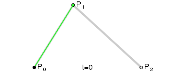
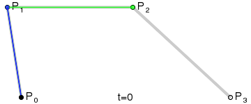
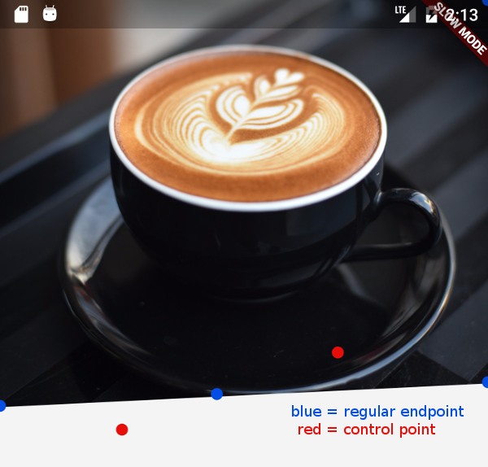

# Clipping

## Essentials

### moveTo

**moveTo** method helps us to move the starting point of the sub-path to the point provided within the method.

### lineTo

**lineTo** is the method to draw a line from the current point of the path to the point provided within the method.

### quadraticBezierTo

**quadraticBezierTo** method was for me the most complicated one to understand. It draws a Bezier Curves and as we learn from Mathematics, it does this with the control point provided.

void quadraticBezierTo (
double x1,
double y1,
double x2,
double y2
)

Adds a quadratic bezier segment that curves from the current point to the given point (x2,y2), using the control point (x1,y1)

### cubicTo

**cubicTo** method adds a Bezier curve in cubic style.
Unlike to quadraticBezierTo, we assign two different control points for . This way you can have the bezier calculations for two control points to have cool views like a wave.

void cubicTo (
double x1,
double y1,
double x2,
double y2,
double x3,
double y3
)

Adds a cubic bezier segment that curves from the current point to the given point (x3,y3), using the control points (x1,y1) and (x2,y2).

### conicTo

**conicTo** is also basically acting like a quadraticBeizerTo wit the only difference being the **weight variable**.

- If the weight is bigger than 1, the drawn shape is a hyperbola.
- If the weight is 1 then drawn shape is parabola
- If it’s smaller than 1, the drawn shape would be an ellipse.

One important thing to note is, as the weight increases, the curve is pulled more to control point.

void conicTo (
double x1,
double y1,
double x2,
double y2,
double w
)

Adds a bezier segment that curves from the current point to the given point (x2,y2), using the control points (x1,y1) and the weight w. If the weight is greater than 1, then the curve is a hyperbola; if the weight equals 1, it's a parabola; and if it is less than 1, it is an ellipse.

### arcTo

**arcTo** is accepting an oval then, gets a start angle and sweep angle as a radian. It starts drawing the oval from the start angle and adds the sweep angle to the start angle.
e.g. For drawing an arc starting from left middle edge to top edge of an oval, we will start from 0 which is the radian value for 0 and add 1.57 which is the radian value for 90.

### addRect

**addRect** adds a rectangle as a new sub-path.

### addOval

**addOval** adds an oval as a sub-path.

### addArc

**addArc** is acting as arcTo.

### addPolygon

**addPolygon** method draws polygon from sets of points. It gets a set of Offset values which will be the positions for the polygon. Lastly it accepts a boolean, true acts like path.close() and draws a straight line between the last and first point and false does nothing.

### addRRect

**addRRect** is a method to create a rounded cornered rectangle. We will use the rectangle above and corners with radius of 16.

### addPath

**addPath** is the method to add one path to another one with an offset. We will add one path with line to the rounded corner rectangle above.

### relativeLineTo

**relativeLineTo** is basically behaving like lineTo but only offsets the drawn shape to the current point. Width the same code lineTo would have the half of the length.

void relativeLineTo (
double dx,
double dy
)

Adds a straight line segment from the current point to the point at the given offset from the current point.

### relativeQuadraticBezierTo

**relativeQuadraticBezierTo** method acts like quadraticBezierTo method. Current point is calculated relative to the current position of the path.

void relativeQuadraticBezierTo (
double x1,
double y1,
double x2,
double y2
)

Adds a quadratic bezier segment that curves from the current point to the point at the offset (x2,y2) from the current point, using the control point at the offset (x1,y1) from the current point.

### relativeConicTo

**relativeConicTo** behaves exactly like conicto method. It calculates the current point relative to the path’s current position.

void relativeConicTo (
double x1,
double y1,
double x2,
double y2,
double w
)

Adds a bezier segment that curves from the current point to the point at the offset (x2,y2) from the current point, using the control point at the offset (x1,y1) from the current point and the weight w. If the weight is greater than 1, then the curve is a hyperbola; if the weight equals 1, it's a parabola; and if it is less than 1, it is an ellipse.

### relativeCubicTo

**relativeCubicTo** method behaves exactly like cubicTo. Only difference is, it’s current position will be calculated relative to the current position of the path.

void relativeCubicTo (
double x1,
double y1,
double x2,
double y2,
double x3,
double y3
)

Adds a cubic bezier segment that curves from the current point to the point at the offset (x3,y3) from the current point, using the control points at the offsets (x1,y1) and (x2,y2) from the current point.

## Example

### Determining the end & control points

- red control points are not where our curved line will touch, but they’ll merely attract the line like a magnet.

### The first curve

These are the facts we know about the first curve:

the endpoint is horizontally a little under the center
the endpoint is vertically a little higher than the starting point
the control point is horizontally at one fourth of the image width
the control point is vertically at the bottom of the image

### The second curve

Here are the facts of the second curve:

the endpoint is horizontally at the right edge of the image
the endpoint is vertically a little higher than the endpoint of the first curve
the control point is horizontally little below 3/4 of the image width
the control point is vertically about 20 pixels or so above the endpoint
