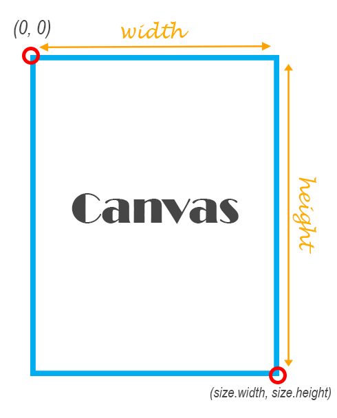

# Custom Painter

## Canvas

The canvas is created and provided to you by the CustomPaint widget which has three important properties:

- painter: This is an instance of the CustomPainter class which draws the first layer of your painting on the canvas.
- child: You can set this to any widget you want. After the painter is done with painting, the child widget is shown on top of the painting.
- foregroundPaint: Finally, this paint is drawn on top of the two previous layers.

### The Size of the Canvas

The CustomPaint object creates a canvas the same size as the size of the child parameter. If the child parameter is not provided (yes, that’s optional), the canvas size is determined by the size parameter that you can provide to CustomPaint object when instantiating it.

In our example, the child is a Center widget which is as big as the screen. Therefore, our canvas will be as big as the whole screen too!

The upper left corner of the canvas is called origin. It’s the point with (0, 0) coordinates. The coordinates of the lower right corner of the canvas are (size.width, size.height):

The Canvas Coordinates

### drawLine

void drawLine (
Offset p1,
Offset p2,
Paint paint
)

Draws a line between the given points using the given paint. The line is stroked, the value of the Paint.style is ignored for this call.

The p1 and p2 arguments are interpreted as offsets from the origin.

### drawCircle

void drawCircle (
Offset c,
double radius,
Paint paint
)

Draws a circle centered at the point given by the first argument and that has the radius given by the second argument, with the Paint given in the third argument. Whether the circle is filled or stroked (or both) is controlled by Paint.style.

### drawRect

void drawRect (
Rect rect,
Paint paint
)

Draws a rectangle with the given Paint. Whether the rectangle is filled or stroked (or both) is controlled by Paint.style.

### drawRRect

void drawRRect (
RRect rrect,
Paint paint
)

Draws a rounded rectangle with the given Paint. Whether the rectangle is filled or stroked (or both) is controlled by Paint.style.

### drawOval

void drawOval (
Rect rect,
Paint paint
)

Draws an axis-aligned oval that fills the given axis-aligned rectangle with the given Paint. Whether the oval is filled or stroked (or both) is controlled by Paint.style.

### drawArc

void drawArc (
Rect rect,
double startAngle,
double sweepAngle,
bool useCenter,
Paint paint
)

Draw an arc scaled to fit inside the given rectangle. It starts from startAngle radians around the oval up to startAngle + sweepAngle radians around the oval, with zero radians being the point on the right hand side of the oval that crosses the horizontal line that intersects the center of the rectangle and with positive angles going clockwise around the oval. If useCenter is true, the arc is closed back to the center, forming a circle sector. Otherwise, the arc is not closed, forming a circle segment.

This method is optimized for drawing arcs and should be **faster than Path.arcTo**.

## The Painter

The CustomPainter class has two important functions to override:

- paint: The actual painting happens here. Did you notice the two parameters provided to this function? In this function, you have access to the canvas object which is indeed your paper, and also the size of the canvas on which you are going to draw.
- shouldRepaint: In this function, you should either return true or false. If your painting depends on a variable and that variable changes, you return true here, so that Flutter knows that it has to call the paint method to repaint your painting. Otherwise, return false here to indicate you don’t need a redraw.
